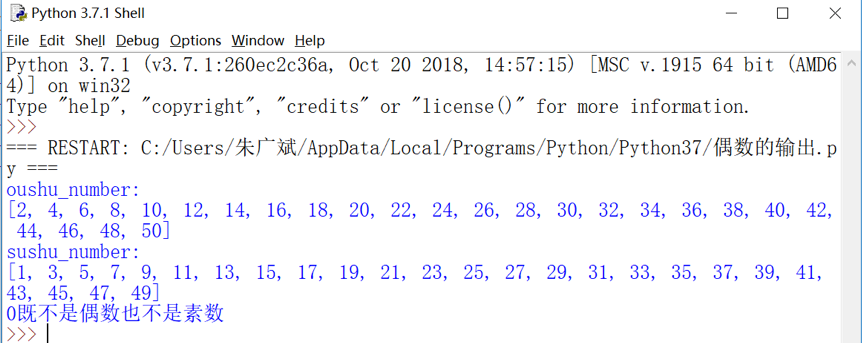
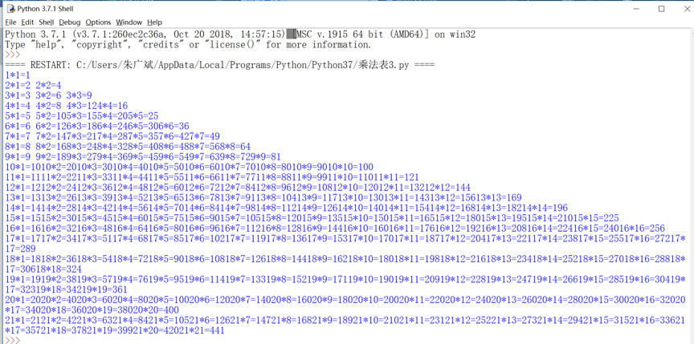
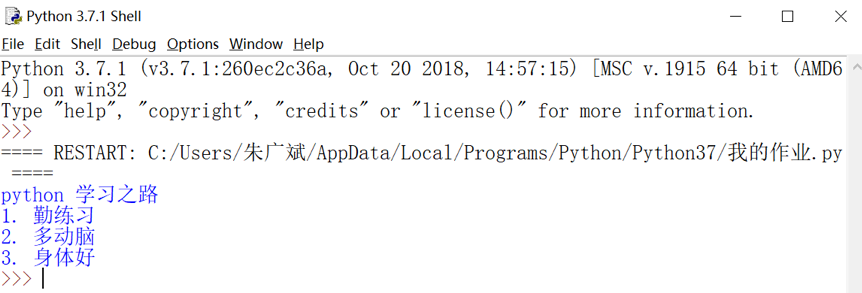

# 广斌提交的答案

## 问题 1
* 第一次提交(日期: 2018-9-4 23:00)
```C
#include<stuio>
void main(){
    int odd_number[30],oushu[30],i,j,k;
    for(i=0,j=0,k=0;i<=50;i++){
        if(i%2==0)
            oushu[k++]=i;
        else
            odd_number[j++]=i;
        }
    }
```
```
结果：错误，没有输出环节，请修改
```

```python
odd_numbers=[]
oushu=[]
for i in range(51):
    if (i % 2 == 0):
        oushu.append(i)
    else:
        odd_numbers.append(i)    
odd_numbers
oushu
```
```
代码输出结果如下：
[1,3,5,7, 9,11,13,15,17,19,21,23,25,27,29,31,33,37,39,41,43,45,47,49]
[0,2,4,6,8,10,12,14,16,18,20,22,24,26,28,30,32,34,36,38,40,42,44,46,48,50]
```
```
结果：错误，因为0既不是奇数也不是偶数
```
* 第二次提交的代码 (日期: 2019-4-2 20:07)
```python
odd_number=[]
oushu_number=[]
for i in range(1,51):
if(i%2 == 0):
    oushu_number.append(i)
else:
    odd_number.append(i)
print('oushu_number:')
print(oushu_number)
print('sushu_number:')
print(odd_number)
print('0既不是偶数也不是素数')
```

## 题目2
* 第二次提交的代码 (日期: 2019-4-2 20:07)
```python
i = 1
while i:
    j = 1 
    while  j :
        print('{0}*{1}={2}'.format(i,j,i*j).ljust(6),end='')
        if i == j:
            break
        j+=1
        if j >=22:
            break
        print()
    i += 1
    if i >= 22:
        break
```

>空格没控制好
## 题目3
```python
file = open(r"D:\python_work\my.python.txt","r")
str = file.read()
print(str)
file.close()
```

>虽然结果正确，但从文件名看，并没有利用本项目中的文件
## 题目4
>请参考答案